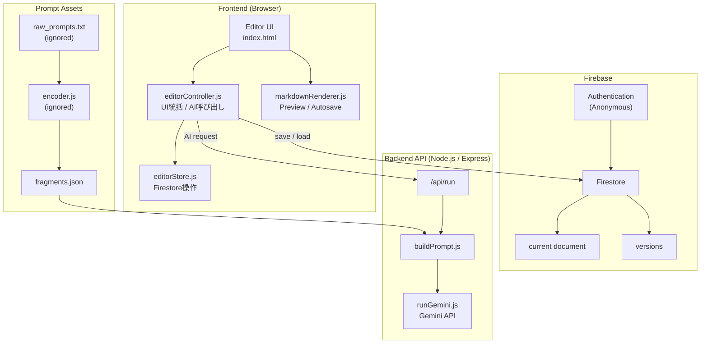
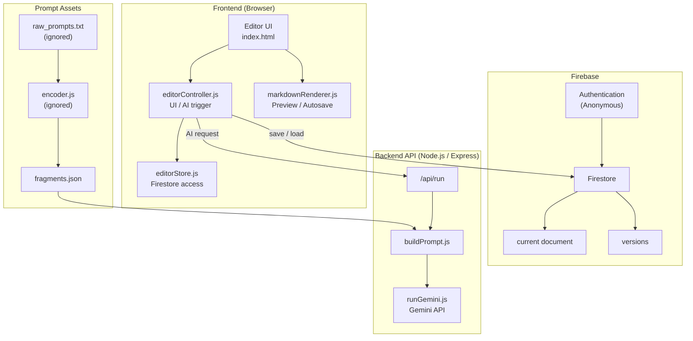

# ① 課題名

**MD Architect
– Prompt-Protected LLM Writing Tool**

---

# ② 課題内容（どんな作品か）

* Markdownテキストを入力し、
  **指示＋Few-shotを与えて再構成・書き換えを行うAIエディタ**
* フロントエンド（HTML / CSS / JS）と
  サーバーサイド（Node.js / Express）を分離した **API構成**
* LLM（Gemini）へのリクエストは **すべてサーバー経由**

  * APIキーは `.env` で管理
  * フロントエンドには一切露出しない
* プロンプトの中核（出力仕様・タスク定義）は
  **断片化・Base64化して vault に格納**
* フロントから送信するのは以下のみ：

  * ユーザー本文（src）
  * 指示（instructions）
  * Few-shot（fewshot）

  → **生プロンプトはクライアントから参照できない構造**

このアプリは単なるAIチャットUIではなく、

> **「プロンプトを“設計資産”として扱い、
> それを安全に運用するための構成実験」**

として設計している。

---

### 主な役割分担

* **フロントエンド**

  * UI
  * ユーザー入力
  * 生成結果の表示（Markdown → HTML）
* **サーバーサイド**

  * プロンプトの組み立て
  * Gemini APIの実行
  * 秘匿情報（APIキー・生プロンプト）の管理

---

# ③ アプリのデプロイURL

https://chiyuria.github.io/gs-md-architect-submit-06/

ローカル環境にて動作確認
※ フロント：Live Server
※ サーバー：Node.js（localhost:3000）

---

# ④ アプリにログイン情報がある場合

なし

---

# ⑤ こだわった点

### ■ フロントに「プロンプトを置かない」設計

* 出力仕様・タスク定義はフロントに一切持たせない
* フロントが送信するのは以下のみ：

  * `src`（本文）
  * `instructions`（指示）
  * `fewshot`（参考例）

→ **最終プロンプトはサーバー側で合成**

---

### ■ プロンプトの断片化・秘匿構成（vault）

* 生プロンプトは `raw_prompts.txt` にのみ存在
* encoder により：

  * 分割
  * Base64化
  * `fragments.json` / `manifest.json` を生成
* decoder は：

  * fragments + manifest から
  * 実行時にのみプロンプトを復元

**GitHubに公開しても内容を直接読めない構成**を維持している。

---

### ■ フロント・サーバー完全分離

* フロント：`127.0.0.1:5500`
* API：`localhost:3000`
* CORSを明示的に設定し、
  **本番構成を前提とした通信設計**を行っている

---

### ■ Markdown特化UI

* 生成結果は Markdown として返却
* `marked.js` + `highlight.js` による即時レンダリング
* **「文章生成 → 構造確認 → 再編集」**を意識したUI設計

---

# ⑥ 難しかった点・次回トライしたいこと

### ■ CORS / フロント・サーバー分離の理解

* Live Server と Express の役割の違い
* preflight（OPTIONS）の挙動
* 「405」「CORS blocked」エラーの切り分け

→ **API設計への理解が一段深まった**

---

### ■ プロンプト秘匿と実行の両立

* フロントに置けば簡単だが、それでは意味がない
* 「実行できるが読めない」状態をどう作るかに悩んだ

---

### ■ 構成増加による心理的負荷

* server / vault / tools に分けた時点で
  全体像が見えにくくなった
* 役割ごとに整理すると、**むしろ理解が進んだ**

---

### ■ 次回やりたいこと

* プロンプトのバージョン管理
* 複数タスク切り替え（mdFormatter / summarizer など）
* 認証付きAPI
* 本番デプロイ

---

# ⑦ フリー項目

* 今回は「まず動かす」よりも
  **「将来どう守れるか」を優先して設計**
* その結果、

  * API
  * プロンプト
  * UI
    の責務分離を明確に学べた
* **AIをソフトウェア資産として扱う視点**が得られた

---

# 🧠 MD Architect – README

---

## 📝 概要（Overview）

**MD Architect** は、
Markdown文章を入力し、指示やFew-shotを与えることで
**構造化・再編集されたMarkdownを生成・管理できるAIエディタ**です。

本プロジェクトは、

> **AI編集 × 永続化 × バージョン管理**

を最小構成で実装した、
**フロントエンド／バックエンド分離設計サンプル**となっています。

---

## 🎮 機能一覧（Features）【修正版・追記込み】

### ▼ Markdown生成（AI）

* 入力テキストをもとに、文書構造を最適化
* 可読性と再利用性を意識したMarkdown生成
* 編集意図に基づく表現の整理
* AI処理はサーバーサイドで実行

---

### ▼ プロンプト資産管理（サーバーサイド）

* プロンプトは **フロントエンドから完全に分離**
* 生プロンプトはGit管理外で保持
* 実行時に必要な断片のみを復元して使用
* プロンプト資産の露出を抑制した設計

---

### ▼ ライブプレビュー & シンタックスハイライト

* 入力と同時にMarkdownを即時レンダリング
* `marked.js` によるパース
* `highlight.js` によるコードハイライト

---

### ▼ Firestoreオートセーブ

* 編集内容を **Firestore に自動保存**
* 入力停止後、一定時間でデバウンス保存
* ユーザーごとに **current ドキュメント** を保持

---

### ▼ バージョン管理（Versioning）

* 任意タイミングで編集内容を **バージョンとしてコミット**
* Firestore上に履歴を保存
* モーダルUIでバージョン一覧を表示
* クリックで過去バージョンを即ロード

---

## 🧩 フロントエンド責務分離

本プロジェクトでは、
**役割ごとにJSファイルを明確に分離**しています。

### ▼ 主な役割分担

| ファイル                  | 役割                          |
| --------------------- | --------------------------- |
| `editorController.js` | UIイベント統括 / AI実行 / Version操作 |
| `editorStore.js`      | Firestore CRUD / データ永続化     |
| `markdownRenderer.js` | Markdownレンダリング / autosave制御 |
| `uiController.js`     | UI補助機能                      |
| `modal.js`            | モーダル制御                      |
| `toast.js`            | トースト通知                      |
| `firebaseConfig.js`   | Firebase初期化 / Auth          |

---

## 🛠 技術スタック（Tech Stack）

### Frontend

* HTML / CSS / JavaScript
* jQuery
* marked.js
* highlight.js

### Backend

* Node.js / Express
* Gemini API

### Storage

* Firebase Authentication（匿名ログイン）
* Firestore（autosave / version管理）

---

## 🔐 APIキー管理について

* **Gemini APIキー** はサーバーサイドの `.env` ファイルで管理しています
  （リポジトリには含めません）

* **Firebaseの設定情報**はリポジトリには含めていません。  
  Authentication および Firestore Security Rules によってアクセス制御を行っています。

---

## 🗂 ディレクトリ構成

### Frontend

```text
docs (app)
├─ css
├─ js
│  ├─ app
│  └─ libs
└─ index.html
```

### Backend / Prompt Assets

```text
server
├─ .env                (ignored)
├─ gemini
│  └─ runGemini.js
├─ prompt
│  └─ buildPrompt.js
├─ vault
│  ├─ fragments.json
│  └─ runner.js
└─ package.json

tools
├─ encoder.js          (ignored)
└─ raw_prompts.txt     (ignored)
```

---

## 🧩 アーキテクチャ（Architecture）



---

## ▶ 使い方（How to Run）

### 1. Backend

```bash
npm install
node server.js
```

### 2. Frontend

```bash
live-server
```

---

## 📘 学習ポイント（Learning）

* フロント／バックエンド分離
* Gemini APIキーの安全な管理（.env）
* Firebaseを用いた永続化設計
* オートセーブのデバウンス制御
* バージョン管理UI実装

---

## 📄 ライセンス

学習目的で制作

---

## ✨ Author

Chiyuria

---

# 🧠 MD Architect – README

---

## 📝 Overview

**MD Architect** is an AI-powered Markdown editor that
generates and manages **structured and refined Markdown documents**
based on user input, instructions, and few-shot examples.

This project is not just an AI experiment, but a
**frontend / backend separated architecture sample** that implements:

> **AI-assisted editing × persistence × versioning**

in a minimal and practical setup.

---

## 🎮 Features

### ▼ Markdown Generation (AI)

* Optimizes document structure based on input text
* Generates Markdown with readability and reusability in mind
* Refines expressions according to editing intent
* AI processing is executed entirely on the server side

---

### ▼ Prompt Asset Management (Server-side)

* Prompts are **fully separated from the frontend**
* Raw prompts are kept outside of Git version control
* Only the required fragments are restored at runtime
* Designed to minimize unintended exposure of prompt assets

---

### ▼ Live Preview & Syntax Highlighting

* Real-time Markdown rendering on input
* Parsing via `marked.js`
* Code highlighting via `highlight.js`

---

### ▼ Firestore Autosave

* Automatically saves editor content to **Firestore**
* Debounced saving after input stops
* Maintains a per-user **current document**

---

### ▼ Version Management

* Commit editor content as versions at any time
* Store version history in Firestore
* Display versions in a modal list
* Instantly load selected past versions

---

## 🧩 Frontend Responsibility Separation

This project clearly separates frontend responsibilities
by dividing logic into role-specific JavaScript files.

### ▼ Main Responsibilities

| File                  | Responsibility                                     |
| --------------------- | -------------------------------------------------- |
| `editorController.js` | UI orchestration / AI execution / version handling |
| `editorStore.js`      | Firestore CRUD / data persistence                  |
| `markdownRenderer.js` | Markdown rendering / autosave control              |
| `uiController.js`     | UI utilities                                       |
| `modal.js`            | Modal control                                      |
| `toast.js`            | Toast notifications                                |
| `firebaseConfig.js`   | Firebase initialization / Auth                     |

---

## 🛠 Tech Stack

### Frontend

* HTML / CSS / JavaScript
* jQuery
* marked.js
* highlight.js

### Backend

* Node.js / Express
* Gemini API

### Storage

* Firebase Authentication (Anonymous)
* Firestore (autosave / versioning)

---

## 🔐 API Key Management

* The **Gemini API key** is managed via a server-side `.env` file
  and is not included in the repository.
* **Firebase configuration** is excluded from the repository.
  Authentication and Firestore Security Rules are used for access control.

---

## 🗂 Directory Structure

### Frontend

```text
docs (app)
├─ css
├─ js
│  ├─ app
│  └─ libs
└─ index.html
```

### Backend / Prompt Assets

```text
server
├─ .env                (ignored)
├─ gemini
│  └─ runGemini.js
├─ prompt
│  └─ buildPrompt.js
├─ vault
│  ├─ fragments.json
│  └─ runner.js
└─ package.json

tools
├─ encoder.js          (ignored)
└─ raw_prompts.txt     (ignored)
```

---

## 🧩 Architecture



---

## ▶ How to Run

### 1. Backend

```bash
npm install
node server.js
```

### 2. Frontend

```bash
live-server
```

---

## 📘 Learning Points

* Frontend / backend separation
* Secure management of Gemini API keys using `.env`
* Persistence design using Firebase
* Debounced autosave implementation
* Version management UI design

---

## 📄 License

Created for learning purposes.

---

## ✨ Author

Chiyuria

---